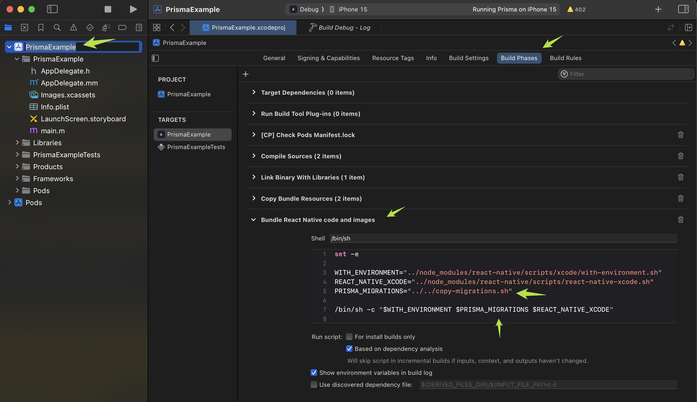

# Early Access: Prisma ORM for React Native and Expo

A Prisma engine adaptation for React Native. Please note that this is in [Early Access](https://www.prisma.io/docs/orm/more/releases#early-access)

## Installation

Install `@prisma/client`, `@prisma/react-native` and the `react-native-quick-base64` dependency:

```
npm i --save --save-exact @prisma/client@latest @prisma/react-native@latest react-native-quick-base64
```

To ensure migration files are copied into the app bundle you need to either enable the Expo plugin or configure ios and Android manually:

### Expo

If you are using Expo, you can add the expo plugin to automatically copy migration files. Modify your `app.json` by adding the react-native-prisma plugin:

```json
{
  "expo": {
    // ... The rest of your expo config
    "plugins": ["@prisma/react-native"]
  }
}
```

To activate the plugin, run prebuild:

```
npx expo prebuild --clean
```

The Expo plugin simply configures the Android and ios projects during the prebuild phase. If you are not using Expo, you can do this manually:


### iOS

Go into `Xcode` → `Build Phases` → `Bundle React Native Code and images` and modify it so that it looks like this:



```bash
set -e

WITH_ENVIRONMENT="../node_modules/react-native/scripts/xcode/with-environment.sh"
REACT_NATIVE_XCODE="../node_modules/react-native/scripts/react-native-xcode.sh"
PRISMA_MIGRATIONS="../node_modules/@prisma/react-native/copy-migrations.sh" # Add this

/bin/sh -c "$WITH_ENVIRONMENT $PRISMA_MIGRATIONS $REACT_NATIVE_XCODE" # Add it to the list of running scripts
```

#### Run Pod Install

Make sure you run `pod-install` to install the native dependencies.

```bash
npx pod-install
```

### Android

For Android you need to modify your apps `app/Build.gradle`. Add the following at the top of the file.

```groovy
apply from: "../../node_modules/@prisma/react-native/react-native-prisma.gradle"
```

## Enable React Native support in your schema file

React Native support is currently a preview feature and has to be activated in your schema.prisma file. You can place this file in the root of the application:

```ts
generator client {
  provider = "prisma-client-js"
  previewFeatures = ["reactNative"]
}

datasource db {
  provider = "sqlite"
  url      = "file:./app.db"
}

// Your data model

model User {
  id           Int     @id @default(autoincrement())
  name         String
}
```

You can create the database file and initial migration using Prisma migrate:

```
npx prisma@latest migrate dev
```


you can now generate the Prisma Client like this:

```
npx prisma@latest generate
```

## Reactive queries

This package contains an extension to the Prisma client that allows you to use reactive queries. Use at your own convenience and care since it might introduce large re-renders in your app.

```ts
import { PrismaClient } from '@prisma/client/react-native';
import { reactiveHooksExtension } from '@prisma/react-native';

const baseClient = new PrismaClient();

export const extendedClient = baseClient.$extends(reactiveHooksExtension());
```

Then in your React component you can use the hook:

```tsx
import { Text } from 'react-native';
import { extendedClient } from './myDbModule';

export default function App {

  // Will automatically re-render the component with new data
  const users = extendedClient.user.useFindMany();

  return (
    <Text>{ users }</Text>
  )
}
```

Bear in mind, for the reactive queries to work you have to use the extended client to modify the data:

```ts
extendedClient.user.create({ ...userData });
```

There are several hooks you can use for your reactive queries:

```ts
useFindMany();
useFindFirst();
useFindUnique();
```

### Non hook reactive queries

It is also possible to use callbacks for this queries in case you are not using hooks, but you still want to get notified when data changes

```ts
import { PrismaClient } from '@prisma/client/react-native';
import { reactiveQueriesExtension } from '@prisma/react-native';

const baseClient = new PrismaClient();

export const extendedClient = baseClient.$extends(reactiveQueriesExtension());
```

## Applying migrations

On application start you need to run the migrations to make sure the database is in a consistent state with your Prisma generated client:

```ts
import '@prisma/react-native';
import { PrismaClient } from '@prisma/client/react-native';

const baseClient = new PrismaClient();

async function initializeDb() {
  try {
    baseClient.$applyPendingMigrations();
  } catch (e) {
    console.error(`failed to apply migrations: ${e}`);
    throw new Error(
      'Applying migrations failed, your app is now in an inconsistent state. We cannot guarantee safety, it is now your responsibility to reset the database or tell the user to re-install the app'
    );
  }
}
```

Care must be taken to ensure migrations will always succeed. Migrations will be executed on the users device at runtime, and if they fail to run, your application will most likely be unable to work correctly. In such a situation, the only option for the user might be to delete all app data and start over.

## Material

🎥 Watch the introduction at App.js here: https://www.youtube.com/watch?v=keZYUjAYSJM

📖 Read the announcement post here: https://www.prisma.io/blog/bringing-prisma-orm-to-react-native-and-expo

📹 Watch Catalin build an app with Prisma and Expo here: https://www.youtube.com/watch?v=65Iqes0lxpQ
